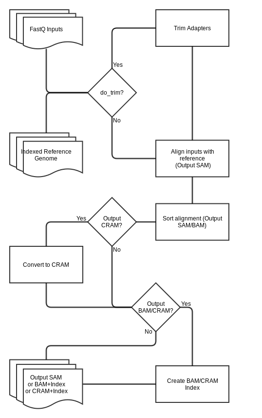

##BWA-MEM Workflow

Version 1.0, SeqWare version 1.1.0

###Overview

This [SeqWare](http://seqware.github.io/) workflow aligns paired-end fastq files (optionally gzipped) into SAM, BAM, or CRAM files using the [BWA](http://bio-bwa.sourceforge.net) MEM algorithm.

###Process

* Optionally trims adapters with CutAdapt
* Aligns samples and adds read group header using BWA-MEM
* Sorts the alignment and optionally converts to BAM using Samtools sort
* Optionally converts to CRAM using Samtools view
* Indexes BAM or CRAM using Samtools index

###Dependencies

This workflow requires:

* [SeqWare](http://seqware.github.io/)
* A BWA reference index built for version 0.7.9 - 0.7.12

If you would like to use trimming, the following also must be installed:
* [cutadapt](https://code.google.com/p/cutadapt/)
* [python 2.7](https://www.python.org/download/releases/2.7/)

###Compile

    mvn clean install

###Usage

After compilation, [test](http://seqware.github.io/docs/3-getting-started/developer-tutorial/#testing-the-workflow), [bundle](http://seqware.github.io/docs/3-getting-started/developer-tutorial/#packaging-the-workflow-into-a-workflow-bundle) and [install](http://seqware.github.io/docs/3-getting-started/admin-tutorial/#how-to-install-a-workflow) the workflow using the techniques described in the SeqWare documentation.

####Options
These parameters can be overridden either in the INI file on on the command line using `--override` when [directly scheduling workflow runs](http://seqware.github.io/docs/3-getting-started/user-tutorial/#listing-available-workflows-and-their-parameters) (not using a decider). Defaults are in [square brackets].

**Input/Output**

Parameter           | Description  | Required? | Default
--------------------|--------------|--------|----------
input_file_1        | File path to sample read 1, in FastQ or gzipped FastQ format, to be aligned | Y | \(small test file\)
input_file_2        | File path to sample read 2, in FastQ or gzipped FastQ format, to be aligned | Y | \(small test file\)
input_reference     | File path to reference genome \(fasta\) to align the sample with | Y | \[hg19_random.fa\]
output_dir          | A standard SeqWare parameter specifying the sub-directory where the output files will be moved | Y | seqware-results
output-prefix       | A standard SeqWare parameter specifying the root directory where the output files will be moved | Y | ./
manual_output       | Whether or not to use manual output. When false, a random integer will be inserted into the path of the file in order to ensure uniqueness. When true, the output files will be moved to the location of output_prefix/output_dir | Y | false
output_format       | Format to output. Options are SAM, BAM, and CRAM. If outputting to BAM or CRAM, the BAM or CRAM index \(.bam.bai or .cram.crai\) will also be generated | Y | BAM
output_file_name    | If provided, this will be used as the output filename, and should include the extension \(.sam, .bam, or .cram\) | N | 
ius_accession       | Used as part of the filename if output_file_name is not provided | Usually | 12345
sequencer_run_name  | Used as part of the filename if output_file_name is not provided | Usually | 121005_h804_0096_AD0V4NACXX
barcode             | Used as part of the filename if output_file_name is not provided | Usually | NoIndex
lane                | Used as part of the filename if output_file_name is not provided | Usually | 5
group_id            | Used as part of the filename if it is provided, and output_file_name is not provided | N | 

**CutAdapt**

Parameter           | Description  | Required? | Default
--------------------|--------------|--------|----------
do_trim | May be set to true or false. If true, adapters will be trimmed before alignment | Y | false
trim_mem_mb | Amount of RAM to allocate for the CutAdapt job, in MB | if trimming | 16384
trim_min_quality |  | if trimming | 20
trim_min_length |  | if trimming | 10
cutadapt_r1_other_params | Additional parameters to use for CutAdapt on read 1 | N | 
cutadapt_r2_other_params | Additional parameters to use for CutAdapt on read 2 | N | 
r1_adapter_trim | Adapter sequence to trim from read 1 | if trimming | AGATCGGAAGAGCGGTTCAGCAGGAATGCCGAGACCG
r2_adapter_trim | Adapter sequence to trim from read 2 | if trimming | AGATCGGAAGAGCGTCGTGTAGGGAAAGAGTGT

**BWA Parameters**

Parameter           | Description  | Required? | Default
--------------------|--------------|--------|----------
bwa_mem_mb | Amount of RAM to allocate for the alignment job | Y | 16384
bwa_threads | Threads to use for for BWA-MEM | N | 8
bwa_pacbio_mode | May be set to true or false. Enables BWA-MEM's PacBio mode, and should be enabled for PacBio data | N | false
bwa_ont_mode | May be set to true or false. Enables BWA-MEM's ONT mode, and should be enabled for Oxford nanopore data | N | false
bwa_mark_secondary_alignments | May be set to true or false. Marks supplementary alignments as secondary for compatibility with Picard | N | true
bwa-other-params | Additional parameters to use for BWA-MEM command | N | 
rg_library | Data to include in read group header | Y | library
rg_platform | Data to include in read group header | Y | illumina
rg_platform_unit | Data to include in read group header | Y | flowcell-barcode_lane
rg_sample_name | Data to include in read group header | Y | sample

**Samtools Parameters**

Parameter           | Description  | Required? | Default
--------------------|--------------|--------|----------
samtools_index_mem_mb | Amount of RAM to allocate for the indexing jobs | Y | 16384

###Output files

* SAM, BAM, or CRAM file - Aligned, possibly compressed sequence, depending on output_format
* BAM.BAI or CRAM.CRAI file - Corresponding index file if output_format is BAM or CRAM

###Support
For support, please file an issue on the [Github project](https://github.com/oicr-gsi) or send an email to gsi@oicr.on.ca .
